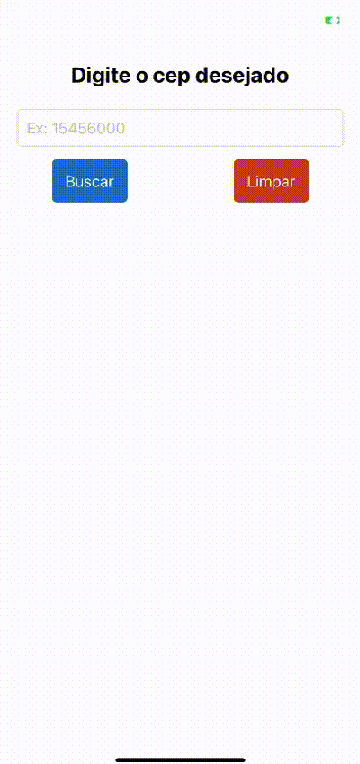

# Projeto Buscador de Cep

# Description
Um app desenvolvido com a tecnologia ReactNative, 
utilizando a Api da ViaCep. Para se obter dados dos CEP. 
Tendo Uma interface simples com layout agradável utilizado do canal do Youtube SujeitoProgramador. 
Precisa de conexão com a Internet para funcionar.

# Technologies

This project was developed with the following technologies:

- Javascript 
- React Native 
- React Hooks 
- Axios 
- Expo 
